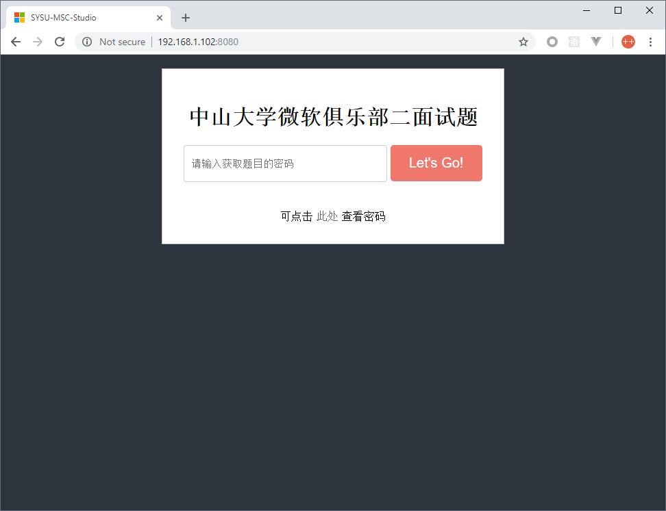

# MSC PDF Server

> 为 中山大学微软俱乐部二面试题 提供静态托管服务

## 介绍

本应用配合 [sysumsc](https://sysumsc.com) 使用。

在工作人员向选手发布各自级别题目的密码（密码与PDF题目文件名称相同）后，即可通过简单的命令开启题目托管服务。

现已实现的功能如下：

+ 密码取件
+ 取件界面
+ 网段过滤

## Build

由于 `fasthttp` 提供了比 `net/http` 更为优秀的内存池优化、工作池优化，且考虑到实验室电脑的硬件性能，本项目最终采用了 `fasthttp` 作为核心库。

```bash
# 获取 fasthttp package
go get -u github.com/valyala/fasthttp

# 编译
. ./build.sh
```

欲要编译其他目标系统的程序，请参照 `golang` 的交叉编译知识点。

## Run

程序使用了 `flag` 工具，可在终端输入 `-h` 查看帮助信息。

```bash
$ ./dist/server -h
Usage of server:
  -addr string
        TCP address to listen to (default "192.168.1.102:8080")
  -dir string
        Directory with trailing slash to serve static files from (default "./")
  -ipnet string
        IPNet to allow access from (default "192.168.1")
```

### 示例

如果我们想在教师机（`172.18.187.149`）的 `D:\MSC` 下开启静态服务，且希望只有该实验室的机器才能访问（即同一网段下的机器均能访问），则可通过以下命令开启服务。

```bash
$ ./dist/server -addr="172.18.187.149:8080" -dir="D:\MSC" -ipnet="172.18.187"
```

## 界面预览


